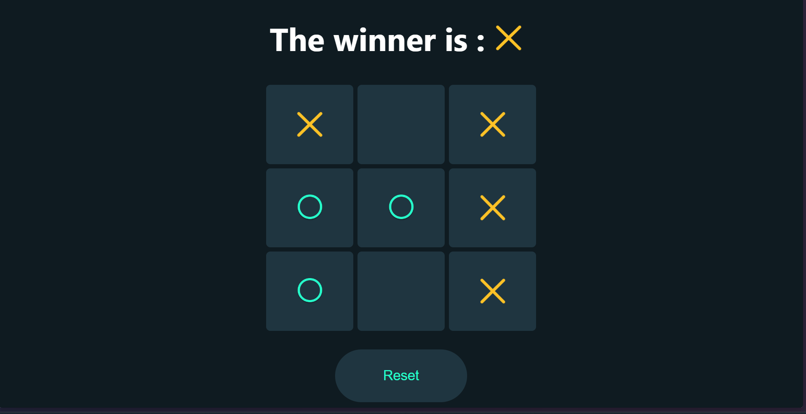

# Tic Tac Toe App

Tic Tac Toe game build with React JS.

## Overview

This project is a classic Tic Tac Toe game where two players take turns marking spaces in a 3×3 grid. The player who succeeds in placing three of their marks in a horizontal, vertical, or diagonal row wins the game.



## Installation
1. **Clone the repository:**
```bash
https://github.com/aldoLorenzio/tic-tac-toe.git
```

2. **Install Depedencies**
```bash
npm install
```

3. **Run the app**
```bash
npm run start
```

4. Open your browser and navigate to `http://localhost:3000` to see the app in action.

## Usage

- Click on any cell in the 3x3 grid to make a move.
- Players alternate turns, with player 1 starting as "X" and player 2 as "O".
- The game automatically detects a win and displays a message.
- Click the "Reset" button to reset the board and start a new game

## Technologies

- **React:** A JavaScript library for building user interfaces
- **JavaScript (ES6):** For game logic and interactivity
- **CSS:** For styling the application


---

Thank you for checking out my Tic Tac Toe app! Have fun playing the game!